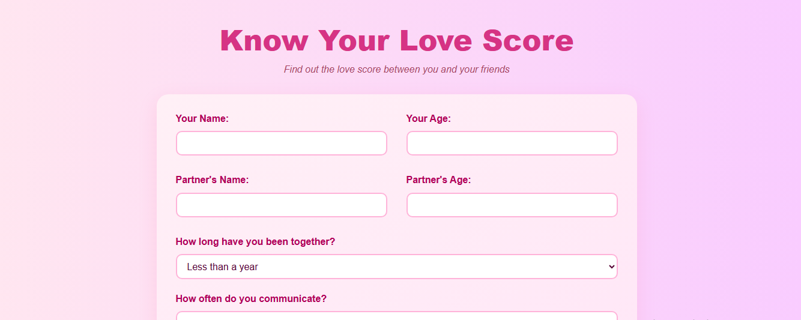

# 💖 RomantIQ – Love Calculator

Ever wondered how compatible you and your crush or bestie are?  
**RomantIQ** is a fun, playful web app that gives you a randomized "love score" based on simple inputs — perfect for laughs, surprises, and maybe a little blushing 👀💘  

Try it out 👉 [romantiq.netlify.app](https://romantiq.netlify.app)

---

## 🚀 Features  
- 🎨 Sleek and modern UI with romantic vibes  
- 📱 Fully responsive – works on mobile, tablet, and desktop  
- 🎯 Randomized love score generator  
- 🥰 Light-hearted and fun to try with friends or crushes  

---

## 🖥️ Preview  


---

## 🛠️ Tech Stack  
- **HTML** – Structure  
- **CSS** – Styling & Responsiveness  
- **JavaScript** – Love logic & interactivity  

---

## 📥 Getting Started  
Clone the repo and run it locally:  
```bash
git clone https://github.com/yourusername/love-calculator.git
cd love-calculator
